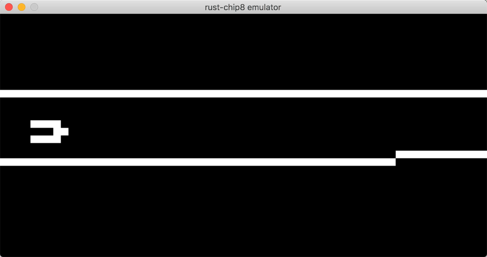

# impl -chip8
又一个 [CHIP 8](https://en.wikipedia.org/wiki/CHIP-8) 模拟器

## 支持平台
- MacOS
- Linux

## 依赖
- Rust 
- Cargo
- SDL2
- [time][rust-time], [rand][rust-rand], [log][rust-log] and [getopts][rust-getopts] crates

[rust-master]: https://github.com/rust-lang/rust
[rust-sdl2]: https://github.com/AngryLawyer/rust-sdl2
[rust-time]: https://github.com/rust-lang/time
[rust-rand]: https://github.com/rust-lang/rand
[rust-log]: https://github.com/rust-lang/log
[rust-getopts]: https://github.com/rust-lang/getopts

## 参考
模拟器非核心 `VM` 部分参考 [`rust-chip8`](https://github.com/pierreyoda/rust-chip8)，本项目主要实现 `VM` 部分逻辑。
